Recently, I took a break from the game I've been working on, **Iron Pulse**. After this break, I decided it's best to start working on a simple model to get used to things again. And thus, I decided I wanted to make some 3d models of some monitors. The level I want to work on has a police department that is in need of some props for its offices anyways.

# Making the models
I wanted to make 2 different monitors: one based off a 27" monitor, and one based off a 57" monitor. This meant that I could have some desks use the larger monitors, some the smaller one and also use that for multi monitor setups.

| | |
|:-------------------------:|:-------------------------:|
Generic 27" monitor I used as a reference: 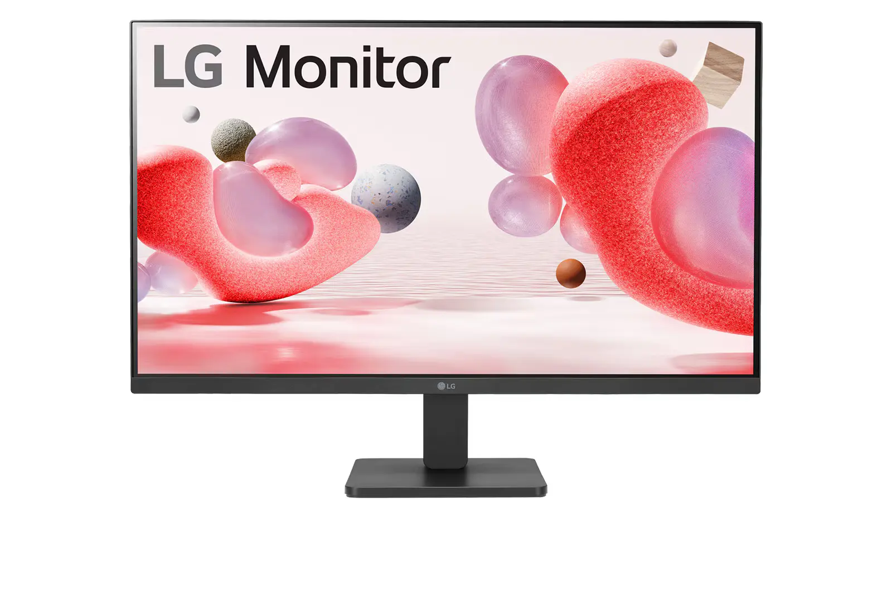| Samsung's 57" monitor I used as a reference: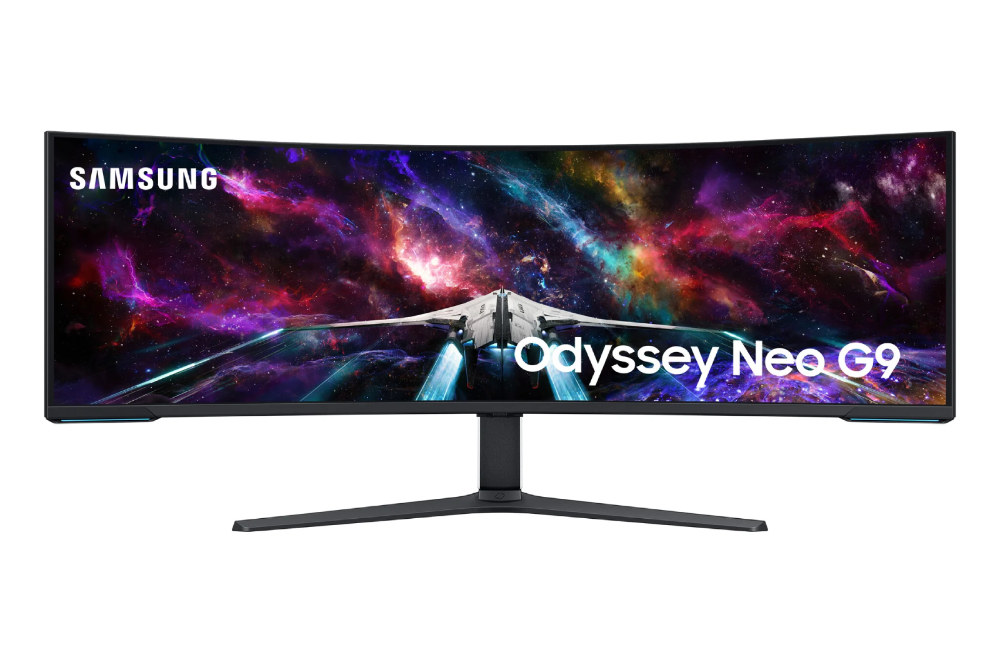

I tried to make the first model look as close to the original as possible, as I quite liked the look, it's the kind of office monitor you see everywhere, though the stand is a *tiny* bit unique. I decided to make the stand a brushed aluminum kind of texture, though.

For the 2nd model, I decided to make the stand a bit different. Mainly because it was easier. It ended up having a trapezoid like base which I quite liked.

| | |
|:-------------------------:|:-------------------------:|
First model: 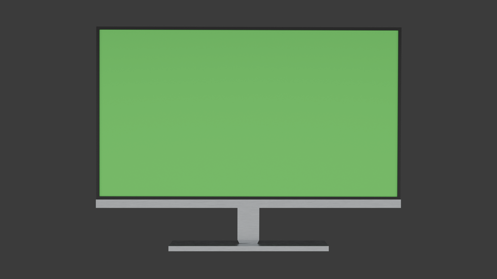 | Second model: 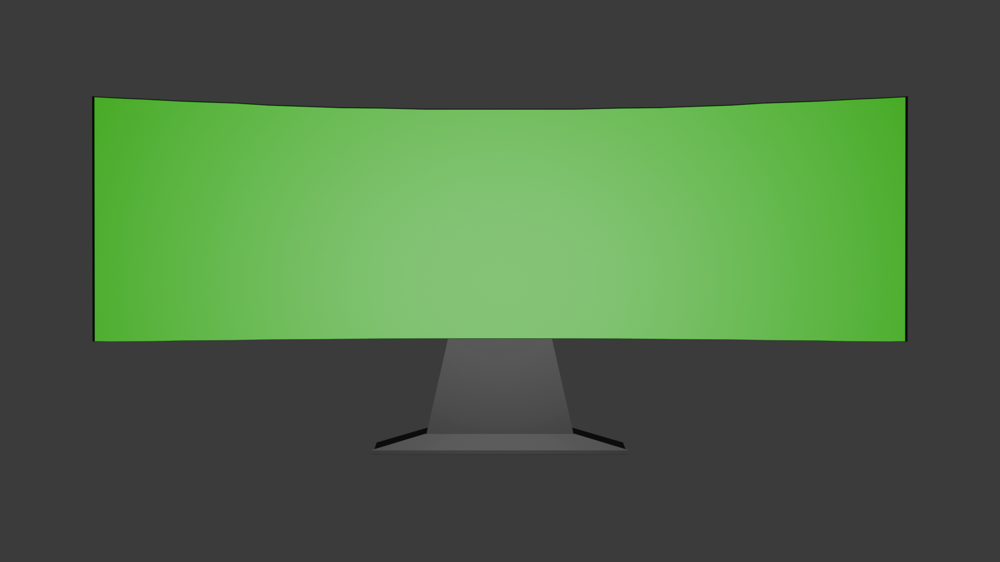

# Making a screen texture
Now for something actually difficult, I had to decide what to actually display on the monitors.

Earlier that day, I had made a new company for the billboard ads seen in game. I called it 'ConformityOS', with the tagline: 'Use us because everyone else does.'
*No, this is totally not referencing any real company.*

| | |
|:-------------------------:|:-------------------------:|
ConformityOS logo: 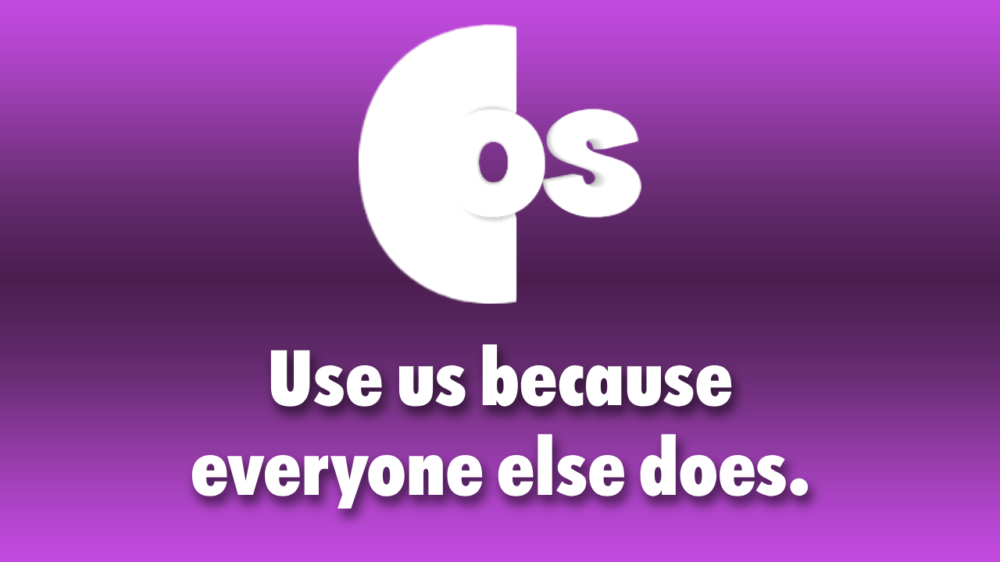 | Billboards seen in-game: 

Very convenient to use as a fake company that makes an operating system to be displayed on the monitors.

I've been making these textures for my game mainly in Photoshop. However, I'm not the best at using Photoshop, I'll admit. For the screen textures, I thought it'd be hard to make elements line up exactly how I wanted them to.

I pondered for a while and came up with the 'great' idea of making an entire application for this purpose. I've made a couple C# apps in the past using [Avalonia](https://avaloniaui.net).

I wanted to make a few screen textures:
- A simple login screen.
- Multiple textures of entering a password for animation.
- A login screen asking you to touch a USB security key.
- A screen that says the account is locked due to too many incorrect password attempts.

With my amazing approach, this took... a few hours, and a whole lot of iterations. Avalonia sure can be both a blessing and a curse sometimes.

| | |
|:-------------------------:|:-------------------------:|
Basic layout. 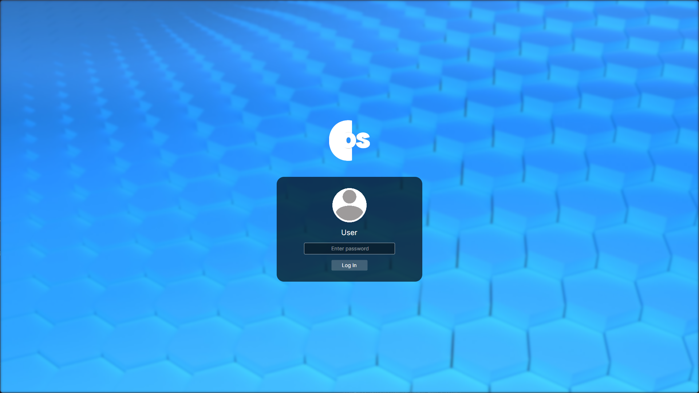 | Adjusted login button. 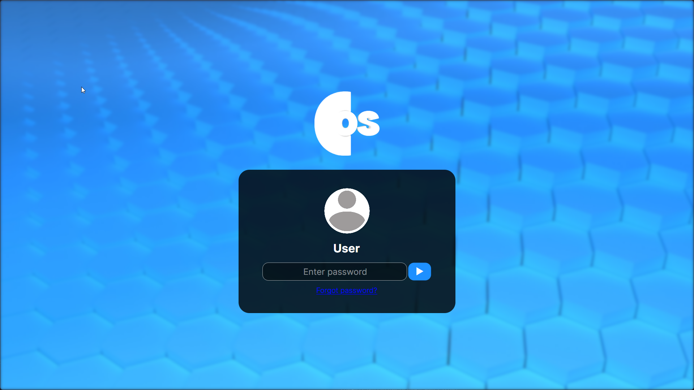 |
Increased scale, changed colours. 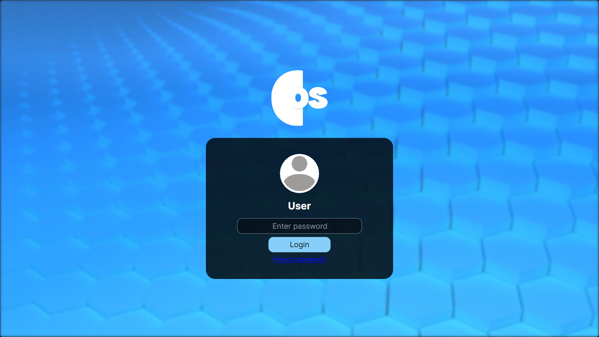 | Removed username, too much scale. 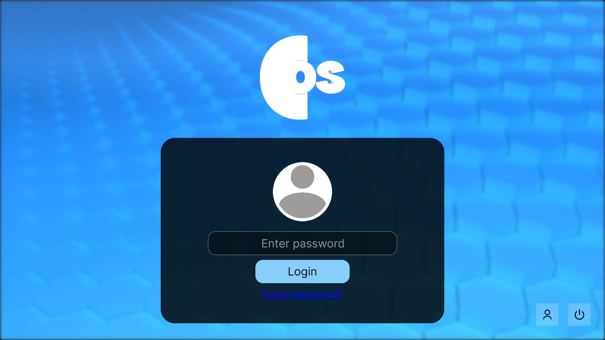 |
Final version. 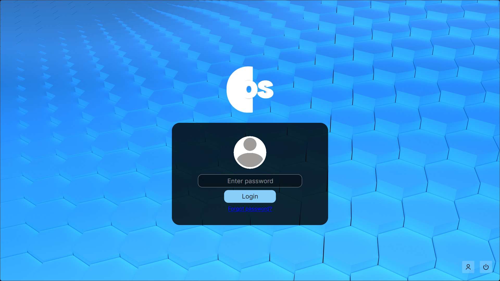 | Account locked screen. Obscure reference to how permanent Xbox 360 bans used to be until 12/31/9999. 
Security key screen. 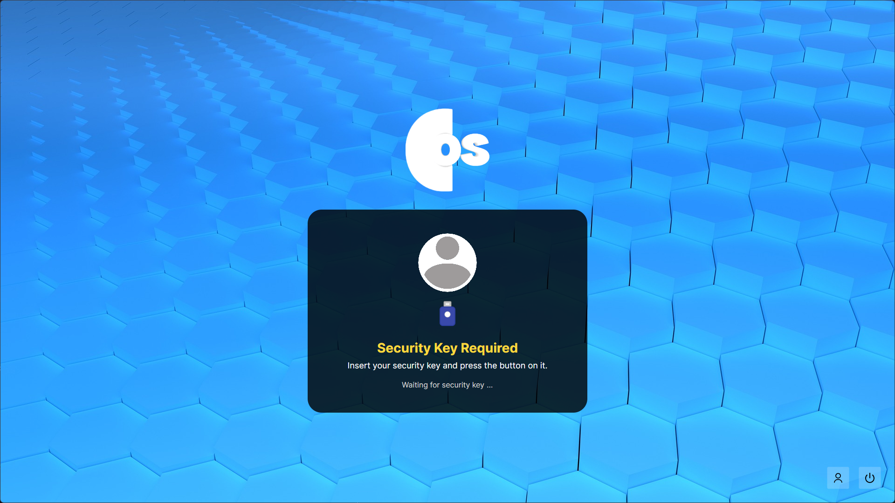

At first, I added hidden buttons that appeared when you hovered in the top right, these buttons let you display the different screens, and I'd manually take a screenshot each time. This ended up getting really annoying as time went on and was kind of jank.

And so I eventually made a function that did this for me whenever I hit F2, which also took... an amount of time to develop. With this, I could also create that typing animation that I wanted.

I'm still not the most experienced with Blender, and am an amature at best. Technically I have been using it since ~2.79b (2018), just before the UI update, but very on and off. I had never properly used an atlas texture before, and it was perfect for this project. I found editing the UVs of the ultrawide monitor at quite hard at first with that curve, but got there in the end.

# Afterword
This is a classic example of being a developer where you try and code something that you *think* will save you time, and you *think* will be easier, and... it's usually the opposite of course.

What have I learned? I have learned that I can make awesome UI in Avalonia still.
Would I do it again? Yeah, probably. I think it was fun to do, and it helped refresh some of the skills I needed. It's also more natural for me to do textures that are similar to UI this way as of now, which is kind of a funny situation to be in.